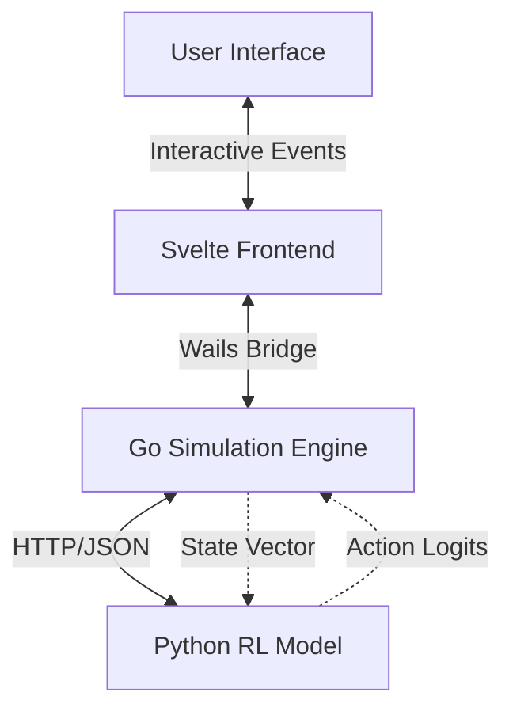

# 🏭 Warehouse MARL

<h3>
  <div align="center">
  A State-of-the-Art Multi-Agent Reinforcement Learning Simulation
  </div>
</h3>

<div align="center">

[](https://go.dev/)
[](https://wails.io)
[](https://svelte.dev/)
[](./LICENSE)

</div>

---

## 🎯 What is Warehouse MARL?

**Warehouse MARL** is an advanced simulation engine designed for testing and visualizing Multi-Agent Reinforcement Learning (MARL) algorithms in complex logistics environments. It bridges the gap between high-performance Go-based backend simulation and Python-based AI training.

Built with a **Cyberpunk Industrial** aesthetic, it offers a real-time, interactive interface for researchers and developers to experiment with robot fleet coordination, pathfinding, and task allocation strategies.

---

## ✨ Features

### 🎮 Interactive Grid Editor
Directly manipulate the warehouse environment in a "God Mode" view.
- **Racks & Obstacles**: Place storage units and barriers.
- **Robot Spawning**: Deploy fleet agents with a click.
- **Task Injection**: Dynamic task allocation editor.

### 🤖 Multi-Agent Coordination
Visualize complex swarm behaviors in real-time.
- **Collision Avoidance**: Watch agents negotiate paths.
- **Cooperative Transport**: Simulates multi-bot payloads.
- **Pathfinding Debug**: Visual overlays for agent decision processes.

### 🔌 AI Brain Bridge
Seamlessly connects to external RL training loops.
- **HTTP/WebSocket API**: Real-time state exchange.
- **Python Integration**: Compatible with PyTorch/TensorFlow backends.
- **State Serialization**: Save/Load complex training scenarios.

### 📊 Live Telemetry
- **Fleet Utility**: Real-time efficiency tracking.
- **Task Throughput**: Monitor items processed per minute.
- **Agent Health**: Status monitoring for individual bots.

---

## 🏗️ Architecture



1.  **Frontend (Svelte)**: Handles rendering, user input, and state visualization via a reactive glassmorphism UI.
2.  **Backend (Go/Wails)**: Manages the 'Ground Truth' simulation state, physics, and communication.
3.  **AI Brain (Python)**: External service (Flask/FastAPI) that decides agent actions based on observations.

---

## 🚀 Quick Start

### Prerequisites
*   **Go 1.21+**
*   **Node.js 18+**
*   **Wails CLI**: `go install github.com/wailsapp/wails/v2/cmd/wails@latest`

### 1️⃣ Start the AI Server
Ensure your Python environment is ready and the brain is listening.
```bash
cd ai_server
pip install -r requirements.txt
python app.py
```

### 2️⃣ Run the Simulation UI
Launch the desktop application in development mode.
```bash
cd warehouse_ui
wails dev
```

### 3️⃣ Build for Production
Create a standalone executable.
```bash
wails build -platform windows/amd64
# Output: build/bin/warehouse_ui.exe
```

---

## 📁 Project Structure

```
warehouse-marl/
├── ai_server/          # 🧠 Python RL Environment
│   ├── models/         # Trained PPO/DQN models
│   └── app.py          # Observation API
├── warehouse_ui/       # 🖥️ Wails Application
│   ├── app.go          # Go/Frontend Bridge
│   ├── main.go         # Application Entry
│   └── frontend/       # Svelte UI Source
│       ├── src/        # Components & Logic
│       └── wailsjs/    # Auto-generated bindings
└── data/               # 💾 Simulation Layouts
```

---

## 🛠️ Tech Stack

<div align="center">

| Component | Technology | Description |
| :--- | :--- | :--- |
| **Frontend** |  | Reactive UI Framework |
| **Backend** |  | High-performance Simulation Logic |
| **Framework** |  | Go/JS Interop Wrapper |
| **AI Core** |  | RL Training & Inference |

</div>

---

## 📝 License

This project is licensed under the MIT License - see the [LICENSE](./LICENSE) file for details.

<div align="center">
  <sub>Built with ❤️ by JullMol</sub>
</div>