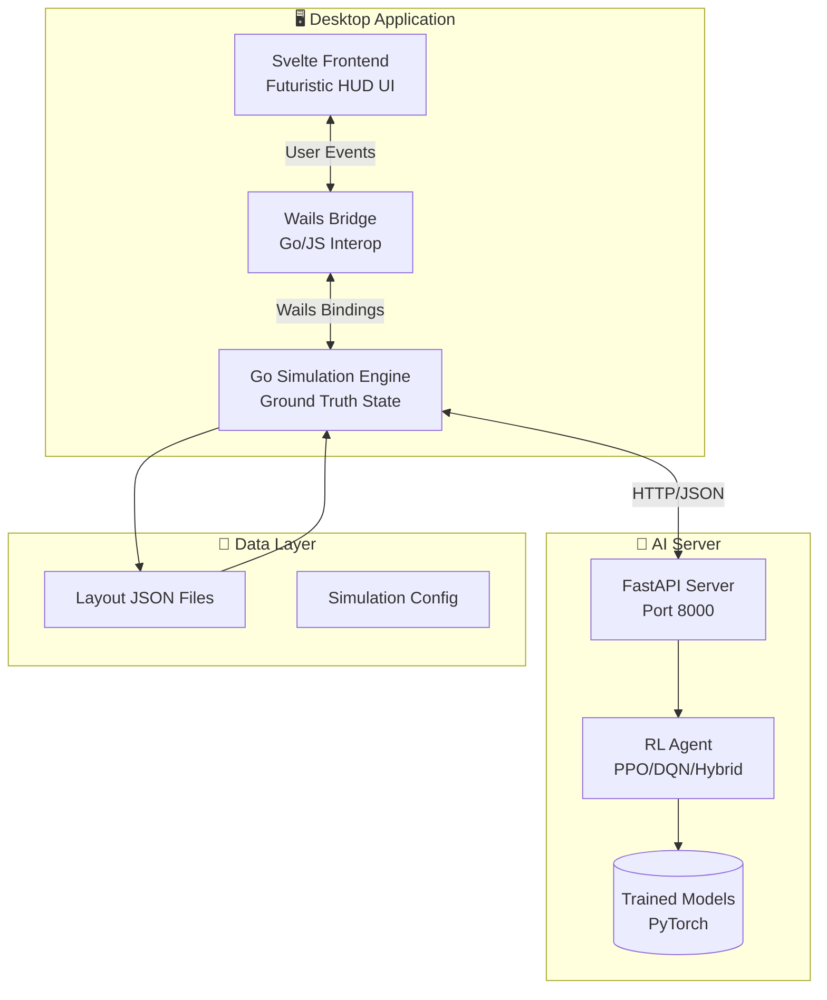

<div align="center">

# 🏭 WAREHOUSE MARL

### ⚡ Multi-Agent Reinforcement Learning Warehouse Simulation ⚡


<br/>

[](https://go.dev/)
[](https://wails.io)
[](https://svelte.dev/)
[](https://python.org/)
[](https://fastapi.tiangolo.com/)

<br/>

**A state-of-the-art desktop simulation for testing and visualizing<br/>Multi-Agent Reinforcement Learning algorithms in warehouse logistics.**

<br/>

[Features](#-features) •
[Installation](#-installation) •
[Usage](#-usage) •
[Architecture](#-architecture) •
[API Reference](#-api-reference) •
[Contributing](#-contributing)

</div>

---

## 🎯 Overview

**Warehouse MARL** is an advanced simulation engine that bridges the gap between high-performance Go-based backend simulation and Python-based AI/ML training. It provides researchers and developers with an interactive, real-time environment to experiment with:

- 🤖 **Robot Fleet Coordination** - Multi-agent pathfinding and collision avoidance
- 📦 **Task Allocation Strategies** - Dynamic workload distribution algorithms
- 🧠 **Reinforcement Learning** - PPO, DQN, and custom policy training
- 📊 **Performance Analysis** - Real-time telemetry and metrics visualization

Built with a **Futuristic Command Center** aesthetic featuring glassmorphism UI, animated HUD elements, and holographic visual effects.

---

## ✨ Features

<table>
<tr>
<td width="50%">

### 🎮 Interactive Grid Editor
- **Place Racks & Obstacles** - Design custom warehouse layouts
- **Deploy Robots** - Spawn AI agents with visual feedback
- **Assign Tasks** - Dynamic goal injection system
- **Erase Mode** - Quick layout modifications

</td>
<td width="50%">

### 🤖 Multi-Agent Coordination
- **Collision Avoidance** - Smart path negotiation
- **A* Pathfinding** - Fallback navigation system
- **Anti-Loop Detection** - Prevents stuck agents
- **Real-time Visualization** - See decisions as they happen

</td>
</tr>
<tr>
<td width="50%">

### 🔌 AI Brain Bridge
- **HTTP REST API** - Standard JSON communication
- **Python Integration** - PyTorch/TensorFlow compatible
- **State Serialization** - Save/load training scenarios
- **Hot-swappable Models** - Switch AI backends on the fly

</td>
<td width="50%">

### 📊 Live Telemetry
- **Step Counter** - Track simulation progress
- **Task Queue** - Monitor pending workload
- **Robot Status** - Individual agent health
- **Connection Status** - AI server monitoring

</td>
</tr>
</table>

---

## 🏗️ Architecture



### Component Breakdown

| Layer | Technology | Responsibility |
|:------|:-----------|:---------------|
| **Frontend** | Svelte + Vite | Reactive UI, user input, visualization |
| **Bridge** | Wails v2 | Go/JavaScript interoperability |
| **Backend** | Go 1.21+ | Simulation state, physics, communication |
| **AI Server** | FastAPI + Python | RL inference, action computation |
| **Models** | PyTorch | Trained policy networks |

---

## � Installation

### Prerequisites

Ensure you have the following installed:

| Requirement | Version | Installation |
|:------------|:--------|:-------------|
| **Go** | 1.21+ | [go.dev/dl](https://go.dev/dl/) |
| **Node.js** | 18+ | [nodejs.org](https://nodejs.org/) |
| **Python** | 3.10+ | [python.org](https://python.org/) |
| **Wails CLI** | Latest | `go install github.com/wailsapp/wails/v2/cmd/wails@latest` |

### Quick Setup

```bash
# Clone the repository
git clone https://github.com/JullMol/warehouse-marl.git
cd warehouse-marl

# Install Python dependencies
cd ai_server
pip install -r requirements.txt

# Install frontend dependencies
cd ../warehouse_ui/frontend
npm install
```

---

## 🚀 Usage

### Option 1: Development Mode

Run both servers for development with hot-reload:

<table>
<tr>
<th>Terminal 1 - AI Server</th>
<th>Terminal 2 - Wails App</th>
</tr>
<tr>
<td>

```bash
cd ai_server
python main.py
```

</td>
<td>

```bash
cd warehouse_ui
wails dev
```

</td>
</tr>
</table>

The app will open automatically. The AI server runs on `http://127.0.0.1:8000`.

### Option 2: Production Build

Build a standalone Windows executable:

```bash
cd warehouse_ui
wails build -platform windows/amd64
```

Output: `build/bin/warehouse_ui.exe`

### Option 3: Download Release

Download the pre-built executable from [GitHub Releases](https://github.com/JullMol/warehouse-marl/releases).

---

## 🎮 How to Use

### 1️⃣ Design Your Warehouse

| Mode | Action | Description |
|:-----|:-------|:------------|
| **RACK** | Click empty cell | Place storage rack/obstacle |
| **ROBOT** | Click empty cell | Deploy a new robot agent |
| **TASK** | Click empty cell | Assign a pickup task |
| **ERASE** | Click any element | Remove racks, robots, or tasks |

### 2️⃣ Run Simulation

1. Ensure **AI CORE ONLINE** status is green
2. Place at least **1 robot** and **1 task**
3. Click **▶ START** to begin simulation
4. Watch robots navigate to complete tasks
5. Click **⏹ STOP** to pause, **🔄 RESET** to restart

### 3️⃣ Monitor Telemetry

The sidebar displays real-time metrics:
- **STEP** - Current simulation timestep
- **TASKS** - Total assigned tasks
- **ROBOTS** - Active robot count
- **PENDING** - Remaining workload

---

## 🔌 API Reference

The AI Server exposes the following endpoints:

### Health Check
```http
GET /
```
Returns: `{"status": "ok", "message": "SMART HYBRID RL Engine Ready"}`

### Initialize Environment
```http
POST /init_env
Content-Type: application/json

{
  "json_path": "path/to/layout.json"
}
```

### Get Robot Action
```http
POST /get_action
Content-Type: application/json

{
  "robot_id": 0,
  "current_pos": [5, 5],
  "grid": [[0, 0, ...], ...]
}
```

Returns:
```json
{
  "action": 1,
  "target": [10, 10],
  "completed": false,
  "remaining_tasks": 3
}
```

**Action Codes:**
| Code | Direction |
|:-----|:----------|
| 0 | Stay |
| 1 | Up |
| 2 | Down |
| 3 | Left |
| 4 | Right |

---

## 📁 Project Structure

```
warehouse-marl/
├── 📂 ai_server/              # Python AI Backend
│   ├── main.py                # FastAPI server entry
│   ├── requirements.txt       # Python dependencies
│   └── 📂 models/             # Trained RL models
│
├── 📂 warehouse_ui/           # Wails Desktop Application
│   ├── main.go                # Go entry point
│   ├── app.go                 # Backend logic & API calls
│   ├── wails.json             # Wails configuration
│   └── 📂 frontend/           # Svelte Frontend
│       ├── index.html         # HTML entry
│       └── 📂 src/
│           ├── App.svelte     # Main component
│           ├── style.css      # Global styles
│           └── main.js        # JS entry
│
├── 📂 data/                   # Simulation Data
│   └── 📂 layouts/            # Warehouse layout JSON files
│
├── 📂 .github/
│   └── 📂 workflows/
│       └── release.yml        # CI/CD for GitHub Releases
│
├── LICENSE                    # MIT License
└── README.md                  # This file
```

---

## 🛠️ Tech Stack

<div align="center">

| Category | Technologies |
|:---------|:-------------|
| **Frontend** |    |
| **Backend** |   |
| **AI/ML** |    |
| **DevOps** |  |

</div>

---

## 🤝 Contributing

Contributions are welcome! Here's how you can help:

1. **Fork** the repository
2. **Create** a feature branch (`git checkout -b feature/amazing-feature`)
3. **Commit** your changes (`git commit -m 'Add amazing feature'`)
4. **Push** to the branch (`git push origin feature/amazing-feature`)
5. **Open** a Pull Request

### Ideas for Contributions
- [ ] Additional RL algorithms (SAC, TD3)
- [ ] Multi-floor warehouse support
- [ ] Performance benchmarking tools
- [ ] Docker containerization
- [ ] Linux/macOS support

---

## � License

This project is licensed under the **MIT License** - see the [LICENSE](./LICENSE) file for details.

---

<div align="center">

### 🌟 Star this repo if you find it useful!

<br/>

**Built with ❤️ by [JullMol](https://github.com/JullMol)**

<br/>

[](https://github.com/JullMol)

</div>